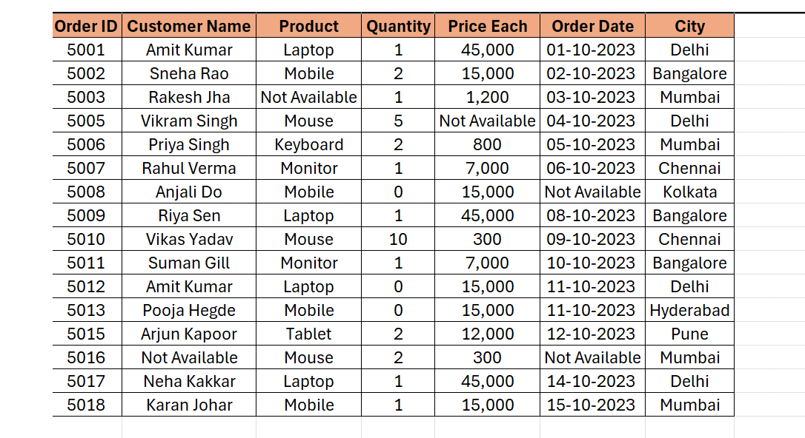
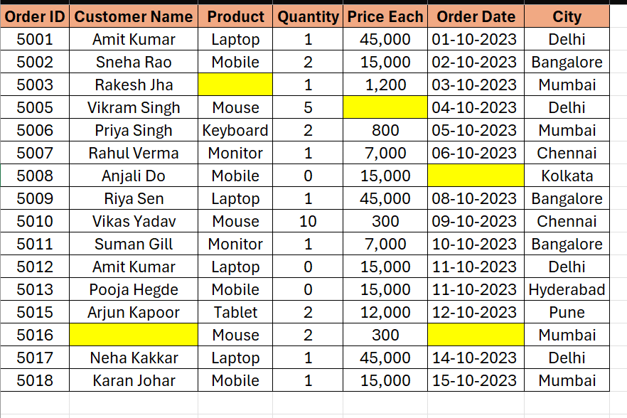
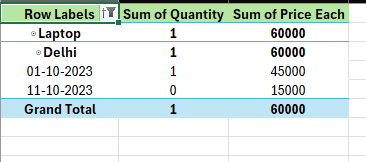
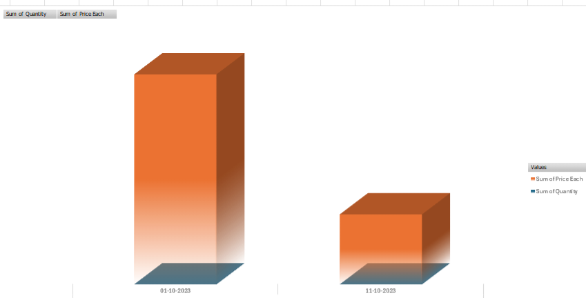

# 📊 Excel Sales Data Analysis & Dashboard

## 📌 Project Overview
Is project mein maine ek raw electronics sales dataset ko end-to-end process kiya hai. Ismein raw data ki cleaning se lekar ek interactive dashboard banane tak ka safar shamil hai.

---

## 🧼 Data Cleaning Step-by-Step
Maine data ki accuracy badhane ke liye ye steps follow kiye:

1. **Duplicates & Formatting:** Sabse pehle raw data se duplicate entries hatayi aur dates ko sahi format mein kiya. (Reference: WhatsApp Image)
2. **Text Cleaning:** Dataset mein maujood unnecessary **underscores (_)** ko remove kiya taaki data readable lage.
3. **Handling Missing Values:** Shuruat mein blank cells ko **"Not Available"** se mark kiya taaki gaps identify ho sakein.
4. **Final Refinement:** "Not Available" ko remove karke un cells ko **Yellow Color** se highlight kiya, jisse missing data ki position saaf dikhe.

---

## 📊 Analysis & Visualizations
Cleaned data ke baad maine following outputs taiyar kiye:

* **Pivot Tables:** Product aur Region-wise performance ko summarize karne ke liye.
* **Pivot Charts:** Sales trends aur Price vs Quantity ko visualize karne ke liye ek interactive dashboard.

---

## 🖼️ Project Journey (Screenshots)

### 1. Raw Data with issue

### 2. Raw Data Cleaning and remove duplicate and date formatting and After cleaning the data, I filled the blank cells with 'Not Available'."

### 3. "Then, I deleted the 'Not Available' text and highlighted the blank cells in yellow."

### 4. Sales Summary (Pivot Table)

### 5. Final Interactive Dashboard

